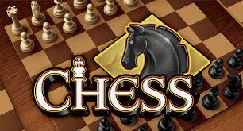

# game-chess.4.0.distributed
Universo Santa Tecla  
[uSantaTecla@gmail.com](mailto:uSantaTecla@gmail.com)  
  
## index

* [requirements](#requirements)  
* [actorsUseCaseDiagram](#actorsUseCaseDiagram) 
* [useCaseContextDiagram](#useCaseContextDiagram) 
* [useCaseSpecification](#useCaseSpecification)
   * [startUseCaseSpecification](#startUseCaseSpecification) 
   * [playUseCaseSpecification](#playUseCaseSpecification)
   * [Vista de Caso de Uso Propose](#vista-de-caso-de-uso-propose)  
   * [Vista de Caso de Uso Undo](#vista-de-caso-de-uso-undo)  
   * [Vista de Caso de Uso Redo](#vista-de-caso-de-uso-redo)  
   * [resumeUseCaseSpecification](#resumeUseCaseSpecification) 
   * [Vista de Caso de Uso incluido ShowBoard](#vista-de-caso-de-uso-incluido-showboard)  
* [interfacePrototype](#interfacePrototype)  
   * [Partida ganada](#partida-ganada)  
   * [Partida perdida](#partida-perdida)  

### requirements 

| [Wiki](https://en.wikipedia.org/wiki/Chess) - [Youtube](https://www.youtube.com/watch?v=soEAyjaeF-w)  * _Funcionalidad: **Básica + Undo/Redo**_   * _Interfaz: **Gráfica y Texto**_   * _Distribución: **Standalone + Client/Server**_   * _Persistencia: **No**_  |  | 
| :------- | :------: |  

### actorsUseCaseDiagram

 

### useCaseContextDiagram
   

### useCaseSpecification
#### startUseCaseSpecification

#### playUseCaseSpecification

#### Vista de Caso de Uso Propose
  

#### Vista de Caso de Uso Undo
  

#### Vista de Caso de Uso Redo
  

#### resumeUseCaseSpecification

#### Vista de Caso de Uso incluido ShowBoard

### interfacePrototype

#### Partida ganada

#### Partida perdida
